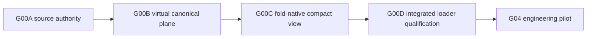

# G00 two-tier data plane

Last verified: 2026-08-16. Status: Dev29 executed evidence plus authoritative
Dev30-A v2 contract amendment.
This page defines storage and loader qualification, not a biological result.

## Decision

Dev28 remains the authoritative negative test of serving full 18,130-feature
GSE314342 raw rows directly to an H100. The measured best layout delivered
10,653 rows/s against a 2,745,553 rows/s threshold. At the observed average
4,136.855 nonzeros per cell, that threshold implied about 91 GB/s of decoded
CSR traffic. The approximately 765 GB duplicate store was correctly not built.

Dev29 separates exact source authority from the latency-critical training view:



| Subcomponent | Package surface | Cohort execution status |
|---|---|---|
| G00A source/feature authority | implemented contract | **PASS**; authority `0bda9cf4…` binds all 12 full source hashes |
| G00B virtual canonical plane | implemented reader and contract | **PASS**; virtual store `cb452528…` |
| G00C fold-native compact materialization | implemented contract | not run |
| G00D integrated loader qualification | implemented contract and validator | not run |
| Full duplicated raw CountStore | retained archival fallback | not required |

No G00C or G00D status may be inferred from dev28 raw-layout probes or the
contract-only Dev30-A amendment. The superseded r2 draft remains historical;
the active execution contract is the
[Dev31 provenance finalization](g00-dev31-provenance-finalization.md).

## G00A: source authority

The authority binds all 12 donor/checkpoint sources, full file hashes, physical
time, matrix shape and nonzero totals, eligible row/nonzero totals, the
canonical feature index, both feature orders, guide and target catalogs, the
eligibility rule, and the canonical row-ID rule. Totals must reconcile across
sources. It produces no model-facing output.

The custom `CUSTOM001_PuroR` feature uses its own declared namespace. Source
hash completion is mandatory; byte size or path identity is not a substitute.

The external dev29 authority reconciles 21,996,842 eligible rows,
90,997,745,441 eligible nonzeros, 18,130 features, 25,956 guide identities, and
12,732 target/control identities. Full-file hashing, observation-metadata reads,
CSR-structure scans, and CSR-value numerical scans are authority operations.
Dev30 v2 records those
explicitly and separately records that protected expression values were not
used for feature selection, fitting, selection, or evaluation.

## G00B: virtual canonical plane

`VirtualCanonicalCountStore` stores metadata, not another raw matrix. Its row
locator maps a globally unique canonical row to source index, source row,
guide, and target. A separate artifact maps canonical feature positions to
each source's physical positions (`canonical_position → source_position`).
The locator is an eligible-only projection: membership is the eligibility
flag, while G00A separately binds each source's total and eligible row counts,
the exact eligibility rule, and the ordered eligible-row hash. Excluded rows
remain reconstructable from their immutable source but are not model-facing.
Reads preserve caller order and duplicates,
and reject unknown rows, invalid permutations, missing catalogs, or changed
artifacts.

New v2 evidence must also bind the numerical CSR audit and exact guide-target
crosswalk. G00B must recompute every relevant G00A parent field, not merely
reference its authority ID.

This plane is intended for sequential sufficient statistics, training-only
feature selection, one-time compact extraction, and forensic reconstruction.
It is explicitly not the direct H100 backend.

## G00C: fold-native compact views

For each leave-one-donor-out fold, feature selection and sample-size selection
must use only the three training donors. A compact view may contain their Rest,
8 h, and 48 h rows plus the held-out donor Rest source rows. Held-out stimulated
rows remain unmaterialized until the model is frozen and sealed.

The first admissible scale curve is 50k, 100k, 250k, 500k, 1m, and optionally
2m training cells. Selection chooses the smallest training-only sample within a
frozen tolerance of the largest candidate. The physical layout is donor,
checkpoint, target, guide, then row. Counts remain exact integers; `uint16` is
allowed only after a maximum-count audit, and feature indices may use `uint16`
only when lossless.

Physical I/O uses contiguous 256- or 512-cell microbatches. The statistical
macro-batch is assembled by gradient accumulation and must remain donor-,
checkpoint-, target-, and guide-balanced. A parity test must bind identical row
IDs, weights, RNG order, gradients, and resume sequence.

Dev30 v2 additionally freezes 59 paired refits, the p95 absolute paired-NLL
equivalence statistic, the ordered feature table, `CUSTOM001_PuroR` as a
technical sidecar, all four row-role counts/hashes, and exact 512 x 8 = 4,096
sampler semantics.

## G00D: integrated qualification

The old raw rows/s ceiling is not a gate. One exact compact view passes only if
all of the following hold together:

- data-wait fraction at most 10% (5% preferred);
- steady-state GPU utilization at least 85%;
- p95 batch readiness covered by the frozen prefetch depth;
- zero row, count, and order errors;
- observed metric absolute and relative errors within frozen tolerances (the
  validator derives the parity decision rather than trusting a receipt flag);
- peak RSS and open-shard counts within contract limits;
- no unbounded loader-memory growth, based on RSS slope upper confidence bound
  and maximum excursion;
- zero loader, CUDA, and monitor errors.

The sharded reader exposes locator bytes, per-shard index bytes, configured
HDF5 raw-data chunk-cache bytes, open handles, and the configurable LRU limit.
Qualification must record process and aggregate worker memory, not just file
size.

## Publication and restart rules

Every shard append must match the exact next frozen P2 chunk: plan, source,
shard, chunk index, cursor interval, guide run, row-ID hash, nonzero count, and
cumulative row identity. A mismatch is rejected before payload mutation.

Final publication is:

```text
BUILDING → FINALIZING(content hash + manifest + destination) → FINALIZED
```

Payload and checkpoint writes are flushed before each state advance. Recovery
is tested after verify, manifest construction, FINALIZING persistence, rename,
directory fsync, and FINALIZED persistence. Conflicting partial/destination
states or changed bytes fail closed.

## Scientific boundary

This architecture amendment was made before opening any outer-donor stimulated
outcome. It changes computational access, not an endpoint, threshold, split, or
claim. G04/G07/G08 real-data work remains blocked until G00D passes. Source
hashing and metadata reconciliation do not authorize model fitting or outcome
evaluation.
