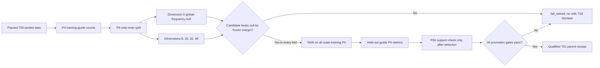

# T01 count-native representation qualification

Last verified: 2026-08-15. Status: authoritative engineering record for the
T01-v1/v2 implementations introduced in `4.0.0.dev19` and retained by dev21;
both real Renz candidates are retired. This document defines software and
development evidence, not a biological claim.

## Decision

T01-v1 and T01-v2 did not pass. The exact global gene-frequency decoder, represented by
candidate dimension 0, won every outer development fold for both tested
count-native representation families. No learned encoder was therefore
selected, refit, or authorized for the pooled Renz dynamics path. T01 remains
open to a newly versioned model family. T02B latent noise and the real-data
dynamics stages remain blocked; T02A raw-count/mass noise and the independent
T04–T07 synthetic numerical path do not depend on T01.

The result is a failure of the two tested Hellinger low-rank representation
families under the frozen T01 estimand. It is not evidence that count-native
representation learning is impossible, and it does not justify changing the
margin, dropping the null, or looking at P60 to select a replacement.

## Why T01 is separate

Representation learning can manufacture apparent trajectory predictability
if terminal cells, outer-held-out guides, or dynamics gradients influence the
encoder. T01 therefore qualifies an encoder before any pooled real-data drift,
diffusion, reaction, ecology, or counterfactual component can run. It does not
block fixed-truth numerical qualification, and it does not replace the T12
claim-grade gene-decoder/program gate.



## Frozen information contract

| Item | Contract |
| --- | --- |
| Parent | One verified `PooledFiniteMeasureBundle` from T00 |
| Count input | CSR raw counts with exact feature and row identities |
| Encoder-fit checkpoint | P4 only |
| Encoder-fit guides | Outer-training guides only |
| Inner selection rows | Guide-stratified P4 holdout inside outer training |
| Protected source rows | Held-out-guide P4 |
| Protected terminal rows | Every P60 cell during selection and refit |
| Candidate dimensions | 8, 16, 32, 48 |
| Update 0/null candidate | Exact global gene-frequency decoder, dimension 0 |
| Dynamics gradients | Disabled |
| Primary loss | Per-count multinomial negative log likelihood, nats/count |
| Primary margin | Learned minus global NLL less than `-1e-4` |
| Uncertainty unit after selection | Perturbation target, not cell or guide |

For each outer fold, ten percent of each training guide's P4 cells, with at
least one cell per guide, forms the inner selection population. The fit and
inner populations are independently capped at 20,000 and 8,192 cells. Row IDs
are canonically sorted before seeded subsampling, and their hashes are written
to `FOLD_INDEX.json`.

The candidate selected in an outer fold is

\[
d^*=\arg\min_{d\in\{8,16,32,48\}} L_d
\]

only among candidates satisfying

\[
L_d-L_0 < -10^{-4}.
\]

If no learned dimension satisfies this inequality, dimension 0 is selected.
This is an ordinary scientific null selection, not a numerical error.

## Mathematical candidates

For a cell count vector \(x\), let \(n=\sum_jx_j\),
\(p_j=x_j/n\), and \(h_j=\sqrt{p_j}\).

The exact global-frequency baseline is fitted from outer-training P4 counts:

\[
f_j=\frac{\sum_i x_{ij}+0.5}{\sum_{i,k}x_{ik}+0.5G},
\]

where \(G\) is the number of features. Its per-cell loss is

\[
L_0(x)=-\frac{1}{n}\sum_jx_j\log f_j.
\]

The `0.5` feature pseudocount gives every retained feature nonzero support.

### V1: uncentered Hellinger PCA

`multinomial_hellinger_pca_v1` fits a low-rank basis \(V_d\) directly to the
P4 Hellinger matrix:

\[
z=hV_d^\top,\qquad
\widehat p=\operatorname{normalize}\!\left((zV_d)^2\right).
\]

The reconstruction is nonnegative after squaring and is renormalized to a
probability vector before multinomial NLL evaluation. This formulation spent
capacity reconstructing the dominant global expression profile, motivating a
separately identified successor rather than a threshold change.

### V2: globally centered residual Hellinger PCA

`multinomial_centered_hellinger_pca_v2` makes the global profile explicit:

\[
c=\sqrt f,\qquad
z=(h-c)V_d^\top,\qquad
\widehat p=\operatorname{normalize}\!\left((c+zV_d)^2\right).
\]

For small matrices the basis comes from a dense SVD of \(h-c\). For large
matrices, a seeded randomized range finder and compressed SVD avoid
materializing the full cell-by-gene matrix. Component signs are canonicalized
by forcing each component's largest-magnitude loading to be positive.

V2 received a new seed, output directory, method identity, implementation
hash, representation ID, and adapter receipt. V1 was never overwritten.

## Conditional post-selection metrics

These metrics are implemented but intentionally run only if every outer fold
selects a learned dimension:

- held-out-guide P4 per-count NLL versus the global decoder;
- held-out-guide pseudobulk gene-composition correlation;
- within-guide P4 split-half latent-centroid distance;
- sister-target versus randomly chosen target-centroid separation;
- split-half distance divided by random-target distance;
- P60 nearest-neighbour support coverage relative to held-out P4 coverage;
- 2,000-draw target-clustered percentile intervals; and
- 20 genuine small count-native refits after guide-target permutation in the
  historical v1/v2 contract.

P60 support uses a nearest-neighbour threshold calibrated as the 99th
percentile of training-P4 calibration distances. P60 is encoded without
refitting, and terminal coverage must be at least 80% of held-out-P4 coverage.

The complete promotion rule requires all of the following:

1. every fold selects a learned dimension;
2. the target-bootstrap upper bound for NLL improvement is below `-1e-4`;
3. the lower bound for normalized target-shared activity exceeds 0.05;
4. the median split-half/random-target distance ratio is at most 0.5;
5. terminal/source support coverage is at least 0.8 in every fold;
6. target-permutation false selection is at most 0.05; and
7. all previously qualified protected metrics pass.

Because both real candidates stopped at item 1, the downstream metrics were
not evaluated. Their empty Parquet tables, empty encoder archive, zero-valued
bootstrap placeholder, and `not_run_no_selected_representation` null record
are explicit fail-closed artifacts. In particular, the recorded point delta
and interval `[0, 0]` do **not** mean that a learned model tied the null.

`protected_metrics_pass=true` in these receipts means that the exact passed
T00 bundle and complete CountStore parent were reverified and unchanged. T01
did not define a separate continuous protected-metric vector beyond those
parent invariants; future learned candidates should add one if additional T00
diagnostics become eligible for quantitative degradation testing.

The historical 20-repeat target permutation was never reached and is not
adequate for a future 5% calibration claim. A successor must use at least 59
genuine global-composition count-null refits for latent-dimension selection
and at least 59 separate leave-one-guide-out guide-target permutation refits
for target-structure calibration; 100 repeats is preferred. The sister-target
centroid for a query guide must exclude that guide in both observed and null
activity calculations.

## Successor decomposition

T01 should no longer be treated as one full-gene reconstruction gate:

1. **T01A count denoising** fits source-only cell composition from a frozen
   encoding split and scores an independent count-thinning split.
2. **T01B latent geometry and stability** tests split-half guide stability,
   leave-one-guide-out target activity, control dispersion, and calibrated
   null selection.
3. **T01C source-to-terminal support** is evaluated only after a source-only
   representation has been selected and refit.

The proposed v3 family is a multinomial logistic factor model. Each P4 count
vector is reproducibly thinned as

\[
x_i^{\mathrm{enc}}\sim\operatorname{Binomial}(x_i,0.8),\qquad
x_i^{\mathrm{score}}=x_i-x_i^{\mathrm{enc}},
\]

and only `enc` counts may fit or infer the latent state. The scored
probabilities are

\[
p_i=\operatorname{softmax}(b+Wz_i),
\]

with one training-P4 intercept `b`, ridge penalties on `W` and `z`, and exact
dimension-zero nesting at `W=0`. During candidate selection, feature selection
and the intercept may use only fit-cell `x_enc` counts. Fit `x_score`, inner
`x_enc`, inner `x_score`, held-out-guide P4, and every P60 count are forbidden.
The global null and every learned dimension are scored on the identical frozen
feature set and intercept. This is a design candidate, not yet a frozen or
executed T01-v3 receipt.

For an inner cell, latent inference uses only `x_enc`; `z_i` is then frozen and
only `x_score` contributes to held-out likelihood. After fitting, the latent
gauge must be canonicalized by centering, deterministic SVD rotation, singular
value order, positive largest-magnitude loading sign, and unit training-latent
variance. This prevents rotationally equivalent fits from producing unstable
artifacts or downstream coefficient penalties.

The candidate dimensions remain `0, 8, 16, 32, 48`. A prospective frozen
feature rule is at least 100 fit-encoding counts, at least 20 nonzero
fit-encoding cells, then the top 4,096 genes by multinomial deviance, recomputed
inside each inner fit partition. The smallest dimension within a frozen tolerance of
the best qualifying held-out-count likelihood is selected.

Before one real fold is opened, v3 must pass three synthetic tests: select
dimension 0 in at least 59/59 pure global-composition fits; recover a known
8- or 16-dimensional logistic-factor truth without library-size dependence;
and recover leave-one-guide-out target structure in a 150-target/∼3-guide
simulation while target permutation removes the activity. A real pilot uses
P4 only and stops immediately if dimension 0 wins. Only a passing pilot can
open the four-fold OOF qualification.

The primary v3 statistical object is the concatenated OOF target-clustered
result, not four separate significance tests. Promotion additionally requires
a negative held-out-count likelihood margin, stable nonzero dimension without
a materially harmful fold, median split-half/random-target ratio at most 0.5,
leave-one-guide-out target separation lower bound above 0.05, control
dispersion inside the T02A noise floor, source support, terminal/source support
ratio at least 0.8, both null false-selection upper bounds below 0.05, a fresh
all-training-P4 refit, and unchanged T00/CountStore parents.

## Real Renz development inputs

The external adapter used the pooled Renz/GSE235325 mouse epidermal screen,
not a human HNSCC cohort and not an independent validation cohort.

| Identity | Value |
| --- | --- |
| T00 pooled-data ID | `7313a9d990900148618edc0fe6a72d5f41e2594641b10d48c278370240964f58` |
| CountStore SHA-256 | `cb7bd724b0adf3b74ec7141d6aa5605566c2b8f3f9b2f3d846482bc7b7efafd4` |
| Feature scope | `common34699`, 34,699 assay-common gene-symbol features |
| Fold-assignment SHA-256 | `fead13d3f85755405ddcdd8962f5cc7eef8db46702b569b0a2fe9ae68fe4121a` |
| Retained guides | 495: 445 targeting and 50 controls |
| Retained cells | 277,200: 110,934 P4 and 166,266 P60 |
| Outer folds | 123, 124, 125, and 123 held-out guides |

The four guide folds were inherited from historically exposed Renz model
development and cover the T00 catalog exactly once. Other guides for the same
target remain in training. T01 is therefore a known-target, guide-held-out
development test, not unseen-target or prospective validation.

## Real results

All values below are P4-only inner-validation NLL deltas in nats/count;
positive is worse than the global decoder.

### V1

| Fold | Global NLL | d=8 | d=16 | d=32 | d=48 | Selected |
| --- | ---: | ---: | ---: | ---: | ---: | ---: |
| fold0 | 8.028093 | +0.256407 | +0.227898 | +0.213463 | +0.211521 | 0 |
| fold1 | 8.023952 | +0.248619 | +0.220152 | +0.206245 | +0.203762 | 0 |
| fold2 | 8.025998 | +0.247401 | +0.218622 | +0.204275 | +0.202065 | 0 |
| fold3 | 8.034082 | +0.249706 | +0.220393 | +0.205816 | +0.203401 | 0 |

Mean deltas for dimensions 8, 16, 32, and 48 were respectively +0.250533,
+0.221766, +0.207450, and +0.205187. V1 status is `fail_retired`.

### V2

| Fold | Global NLL | d=8 | d=16 | d=32 | d=48 | Selected |
| --- | ---: | ---: | ---: | ---: | ---: | ---: |
| fold0 | 8.024258 | +0.233550 | +0.202708 | +0.185275 | +0.183160 | 0 |
| fold1 | 8.027689 | +0.233103 | +0.200140 | +0.182600 | +0.180231 | 0 |
| fold2 | 8.022773 | +0.237764 | +0.207387 | +0.188488 | +0.186294 | 0 |
| fold3 | 8.029755 | +0.227324 | +0.197358 | +0.180659 | +0.178258 | 0 |

Mean deltas for dimensions 8, 16, 32, and 48 were respectively +0.232935,
+0.201899, +0.184256, and +0.181986. V2 status is `fail_retired`.
V2's deltas are numerically smaller, but V1 and V2 used different frozen
seeds and therefore different sampled fit/inner rows. This is not a paired
claim that V2 improved on V1. The valid conclusion is that both were clearly
worse than their own exact global-frequency null in every fold.

## Software surfaces and artifacts

The reusable implementation is in
[`qualification.py`](../src/credo_count_sde_v4/representation/qualification.py).
The typed identity is
[`CountRepresentationBundle`](../src/credo_count_sde_v4/contracts/models.py),
with generated schema
[`count-representation-bundle.v1.json`](../schemas/count-representation-bundle.v1.json).

Python API:

```python
from credo_count_sde_v4 import api

api.qualify_representation(
    destination,
    pooled_bundle=t00_bundle,
    count_store=count_store,
    outer_folds=fold_table,
)
```

CLI:

```bash
credo-v4 qualify-representation \
  --pooled-bundle T00_pooled_data_contract \
  --count-store counts-common.h5 \
  --outer-folds outer-folds.parquet \
  --output T01_count_native_representation
```

Each immutable T01 directory contains:

| Artifact | Meaning |
| --- | --- |
| `TEST_CONTRACT.json` | Frozen component, baseline, margin, and disabled channels |
| `INPUTS.sha256` | T00, CountStore, and fold identities |
| `CONFIG.yaml` | Dimensions, budgets, gates, and seed |
| `CANDIDATE_METRICS.parquet` | P4-only dimension-selection NLLs |
| `FOLD_INDEX.json` | Selected dimension and fit/inner row hashes |
| `ENCODERS.npz` | Selected refit encoder state; empty when dimension 0 wins |
| `PER_GUIDE_METRICS.parquet` | Conditional held-out-guide metrics |
| `PER_TARGET_METRICS.parquet` | Conditional target-level summaries |
| `SUPPORT_METRICS.parquet` | Conditional held-out P4/P60 support coverage |
| `NULL_CALIBRATION.json` | Conditional genuine null-refit receipt |
| `BOOTSTRAP_RESULTS.json` | Conditional target-clustered intervals |
| `CHANNEL_ACTIVITY.json` | Representation activity and channel isolation |
| `SELECTED_MODEL.json` | Dimension, selection checkpoint, and refit status |
| `TEST_RECEIPT.json` | Final pass or `fail_retired` decision |
| `representation.json` | Content-addressed typed bundle |
| `artifacts.json`, `COMMITTED` | Manifest-last atomic publication evidence |
| `SHA256SUMS` | Complete bundle byte verification |

Full verification rehashes the bundle and CountStore, revalidates the T00
parent, checks every typed artifact reference, rejects terminal-informed
selection, confirms fold coverage, checks selected encoder shapes, and verifies
`SHA256SUMS`.

## Tests and release evidence

Focused tests in
[`test_count_representation.py`](../tests/component/test_count_representation.py)
establish that:

- T01 publishes the complete typed receipt surface;
- source and terminal checkpoints stay distinct;
- dynamics gradients and terminal-informed selection remain disabled;
- all expected folds receive one selected candidate;
- complete verification succeeds against the exact T00 and CountStore; and
- replacing every synthetic P60 count realization leaves P4 candidate metrics
  and dimension selection exactly unchanged.

The dev19 repository validation completed with 113 tests passed, one CUDA
smoke test skipped because CUDA was unavailable in that environment, and
86.40% coverage. Ruff, mypy, generated schemas, documentation links,
repository checksums, reproducible wheel/sdist construction, wheel namespace
audit, and a clean wheel-only lifecycle also passed. T01 itself is a CPU
component test; GPU memory is not a scientific selection criterion.

## Interpretation and next allowed action

The global decoder's advantage means these low-rank reconstructions discarded
too much cell-level gene-composition information to earn a latent-state parent
role. The all-positive deltas are much larger than the frozen `1e-4` margin,
so this is not a close-call uncertainty issue or an insufficient-epochs issue.
Neither candidate has trainable epochs, particles, or dynamics parameters.

The next T01 action is to freeze T01-v3 only after its global-null,
known-factor, and target-shared synthetic recovery tests pass. The previous
null must remain exactly selectable, and the new protocol must preserve the
same protected-row boundary. T02B and pooled real-data dynamics must not run
until such a T01 receipt passes. T02A and T04–T07S remain independently
eligible.
